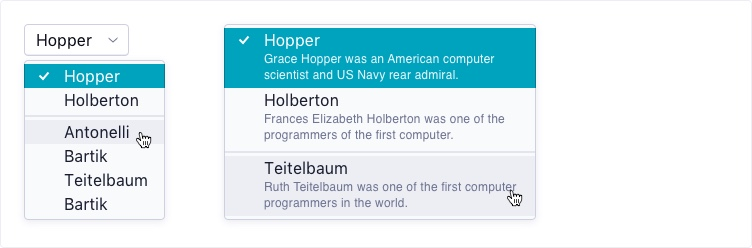

# Design System challenge

Welcome to our exercise. During this test, you will be given the challenge to create a Select Menu component from scratch using React.

If you have any questions, please contact us for clarification, we're happy to help!

## Instructions

1. **Clone** this repo to a location of your choosing.
2. Write your solution to the exercise, making sure you followed the specs carefully.
3. Push your solution to a **private repo** in your **personal Github account**.
4. When you are ready for us to take a look, add the user `adjust-frontend` as a collaborator to your repo.

## Exercise

Using the provided [specs](specs.pdf), create a reusable `Select Menu` component.

- Your component should be written in React.
- You can choose between Javascript or Typescript.
- You can choose how to style your component.

### Bonus

- You can choose how to test your component.

## Expected result

We expect you to create a **reusable** component that can be easily integrated into any project.

Don't forget to add a documentation page with examples of the different use cases of your component, including instructions on how to use it and how to run your project locally.

Good luck!
